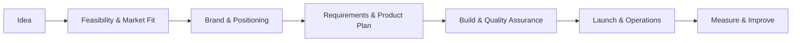
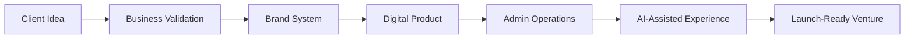
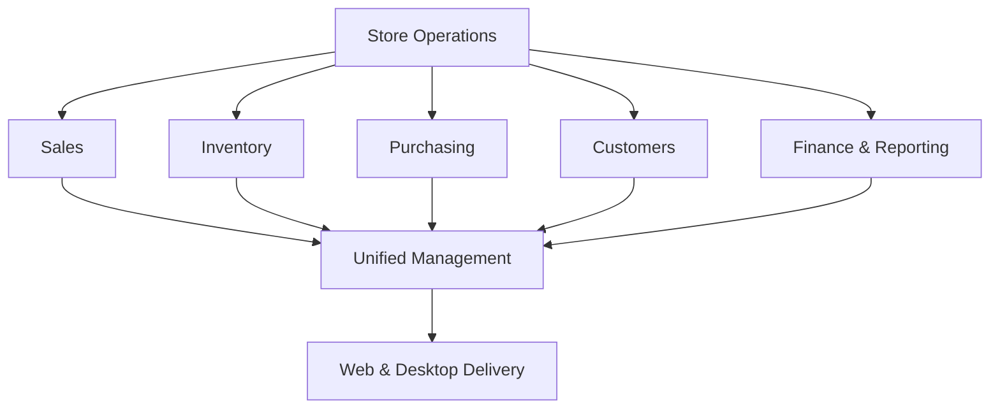
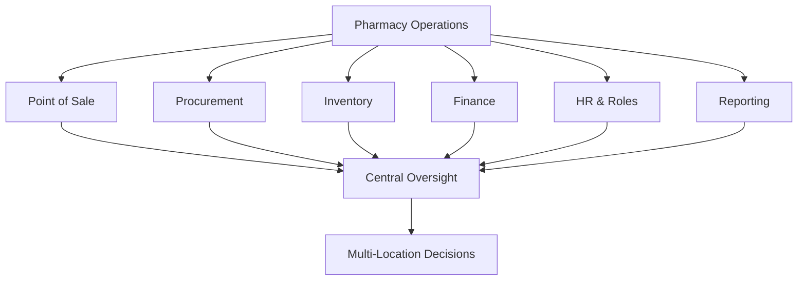

# Selected Product Case Studies

Three concise, documentation-only case studies showing how I turn ideas into commercially useful digital products—from business definition and brand direction to product delivery and operational readiness.

> **Confidentiality note:** These are high-level portfolio summaries. Source code, databases, credentials, architecture details, proprietary workflows, client information, and commercial assets are intentionally excluded.

## My End-to-End Delivery Model

---

## 1. APP-ADD (Abaad)

**Type:** Venture-building company and bilingual digital platform  
**My role:** Co-Founder, CEO, Project Lead, Brand Strategist, and Hands-On Product Builder

### Business Challenge

Create a credible company and operating platform capable of turning early-stage ideas into live businesses while presenting services clearly in both Arabic and English.

### What I Led

- Feasibility and business-model development
- Brand name, logo, personality, and market positioning
- Service design and customer journey planning
- Social-media and business-account presentation
- Bilingual website and administrative dashboard delivery
- AI-assistant feature planning and implementation
- Launch coordination, quality assurance, and continuous improvement

### Delivery View

### Value Created

A unified venture-building foundation connecting business strategy, identity, service delivery, digital operations, and AI-enabled customer support.

**Selected capabilities:** Venture strategy · Project leadership · Brand systems · Laravel · MySQL · Bilingual UX · AI integration

---

## 2. LiBaas (لباس)

**Type:** Licensed ERP for small and medium clothing and footwear retailers  
**My role:** Product Owner, Business Analyst, Project Manager, and Full-Stack Builder

### Business Challenge

Retailers often manage sales, stock, purchasing, customers, and financial records through disconnected tools. LiBaas was conceived as one coherent operating system that can run through web hosting and a desktop application.

### What I Led

- Retail workflow analysis and product definition
- Requirements, priorities, and release planning
- Full web and desktop product delivery
- License-system design and commercial deployment model
- Data, reporting, and operational workflow integration
- Testing, release preparation, and product iteration

### Product View

### Value Created

A commercially deployable retail-management product that centralizes daily operations and supports different delivery environments without exposing business data or product logic publicly.

**Selected capabilities:** ERP product strategy · Retail operations · Laravel · MySQL · Desktop integration · Licensing · Reporting

---

## 3. Pharmacy ERP

**Type:** Multi-location ERP designed for small, medium, and large pharmacies  
**My role:** Product Owner, Business Analyst, Project Manager, and Full-Stack Builder

### Business Challenge

Pharmacies need accurate coordination across sales, procurement, stock, finance, people, and management reporting—often across multiple branches and user roles.

### What I Led

- Pharmacy workflow research and requirements analysis
- Product scope, priorities, and module coordination
- Full ERP implementation and administrative workflows
- Multi-location operating model and role-based experience
- Quality assurance, reporting, and deployment readiness
- Continued iteration using AI-assisted development workflows

### Operational View

### Value Created

A scalable operational platform that brings core pharmacy functions into a unified management environment while supporting different business sizes and organizational needs.

**Selected capabilities:** ERP analysis · Multi-location operations · Product leadership · Laravel · MySQL · Reporting · Quality assurance

---

## Delivery Principles

- Business value before technical complexity
- Clear requirements and measurable priorities
- Hands-on ownership from concept to launch
- Security and confidentiality by design
- AI tools used to increase productivity—not replace judgment, accountability, or quality control
- Continuous improvement based on operational needs

## Source-Code Policy

These products are commercial intellectual property. This repository contains portfolio documentation only. No production code, internal documentation, credentials, client data, private assets, database structures, or proprietary implementation details are included.

## Contact

- [LinkedIn](https://www.linkedin.com/in/osama-waheeb-al-shibani/)
- [GitHub Profile](https://github.com/Osaka2001)
